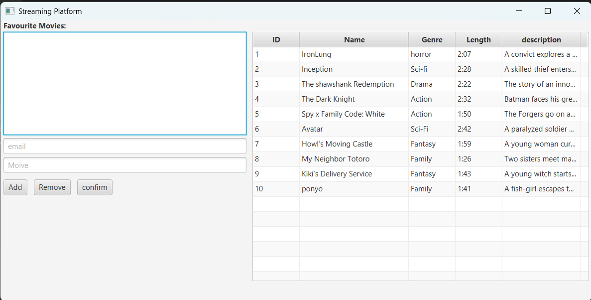

# JavaFX Streamingplatform

This is a simple JavaFX streaming platform that allows a user to add movies to their favorites and display movies from a database in a SceneBuilder UI.

## Description
- Display a list of movies from a database
- Add movies to a user's favorites
- View a user's favorite movies
- Built using JavaFX and SceneBuilder for the GUI
- Supports database storage for movies and user favorites

## Technologies Used
- Java 24
- JavaFX 24
- SceneBuilder (for UI design)
- MySQL for database storage

## Installation / Setup
1. Clone the repository:
   ```bash
   https://github.com/nicky4gun/NetFlix.git
   
# Usage
- insert an email in to the email txtField 
click on a movie.
press the add button to see the moive in your favorite list

- if you want to remove that movie 
  insert your email 
  go and click on the movie in your favorites 
  and press the remove button
  
### Instructions

1. Create the database in your preferred DBMS (SQLite, MySQL, etc.).
2. go to the sql folder and find schema.sql and copy it to your own DataBase.
3. optional(go to the seed.sql and copy that in to your own Database to get som email and movies )
4. Update the database connection settings in the `Database.java` file (URL, username, password).

# Screenshot
 


# Refleksionsspørgsmål til aflevering

### Hvorfor må der ikke ligge sql i controlleren?

- Man må ikke have en SQl i controlleren, fordi 
 det gør det nemmer at velidge holder og testbar samt gøre koden mere ren 
og controller må kun holde styr på UI  fordi SQl har noget angåne DATA access

### Hvor ligger validering og hvorfor?
 - Det ligger i service-delen. Validering af logik der for skal det være i service som hånteer logik det med til at gøre det mere overskuligt og ren

### Hvad er fordelen ved repository interfaces?
 - Vi har ikke brugt denne del men fordelen er vel, det adskiller database fra Service-delen 

### Nævn to eksempler på srp fra jeres kode?
- Vi har flere repositorys og Services (Opdelt efter objekttype)
- Vi har forsøgt at op dele ansvaret for hver metode, så de hver især kun har ét ansvar, 

### Hvad er fordelen ved preparedstatement?
- Mindsker risiko for SQL injektion. ved at låse strukturen


